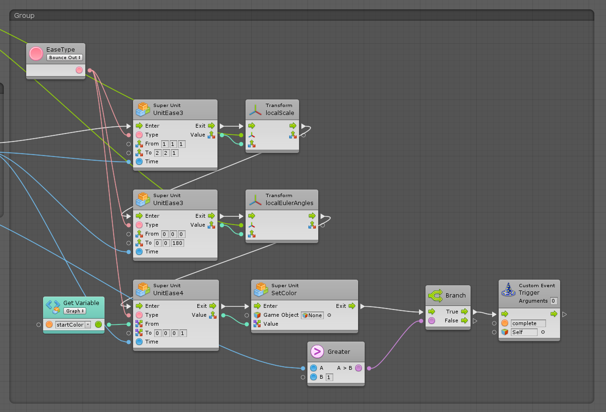
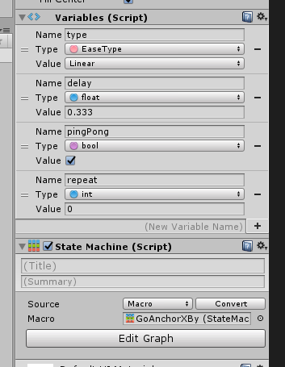
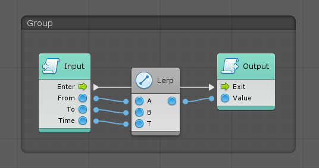
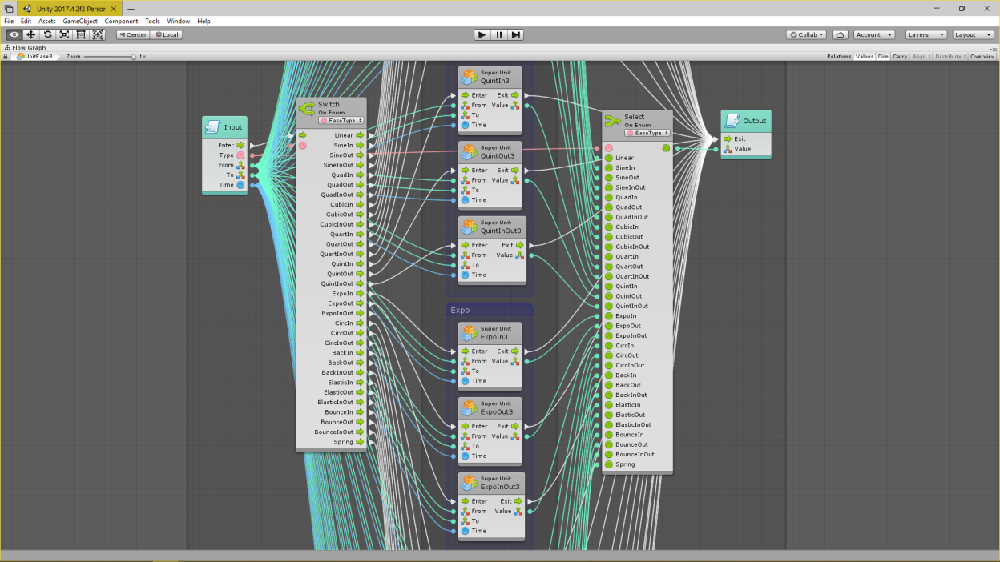

# **UnitEase:** Unity Bolt Easing

<mailto:rakkarage@gmail.com>

<http://henrysoftware.ca>

Based on:

- <http://robertpenner.com/easing/>
- <https://github.com/dentedpixel/LeanTween>
- <https://github.com/rakkarage/Ease>
- many other easing systems

## Instructions

You can drag a Flow Macro into your flow and hook it up, as I do in the Intro scene.
It takes an ease type, a from and to value, a time, and it outputs the value beTWEEN from and to for the given time.

Or you can attach a Flow State and set variables as I do in the Test scene.

### Type Flow Macros

- Linear,
- SineIn, SineOut, SineInOut,
- QuadIn, QuadOut, QuadInOut,
- CubicIn, CubicOut, CubicInOut,
- QuartIn, QuartOut, QuartInOut,
- QuintIn, QuintOut, QuintInOut,
- ExpoIn, ExpoOut, ExpoInOut,
- CircIn, CircOut, CircInOut,
- BackIn, BackOut, BackInOut,
- ElasticIn, ElasticOut, ElasticInOut,
- BounceIn, BounceOut, BounceInOut,
- Spring

### Flow States

- GoAlpha
- GoAlphaBy
- GoAlphaTo
- GoAnchorX
- GoAnchorXBy
- GoAnchorXTo
- GoColor
- GoColorBy
- GoColorTo
- GoPosition
- GoPositionBy
- GoPositionTo
- GoRotation
- GoRotationBy
- GoRotationTo
- GoScale
- GoScaleBy
- GoScaleTo

### Flow Macros

- UnitEase
- UnitEase2
- UnitEase3
- UnitEase4

### Optional Input Variables

- type: EaseType
  - default: linear
- from: float, vector2, 3, 4
  - default: 0, (0, 0), (0, 0, 0), (0, 0, 0, 0)
- to: float
  - default: 1, (1, 1), (1, 1, 1), (1, 1, 1, 1)
- time: float (between 0 and 1)
  - default: 1, (1, 1), (1, 1, 1), (1, 1, 1, 1)
- delay: float
  - default: 0, (0, 0), (0, 0, 0), (0, 0, 0, 0)
- unscaled: bool (use unscaled time, for ui)
  - default: false
- repeat: integer (0 or -1 = forever)
  - default: 1
- pingPong: bool (each repeat includes reverse back to start?)
  - default: false

